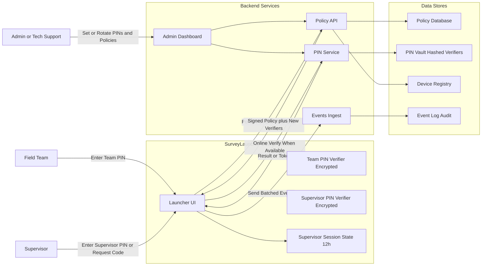
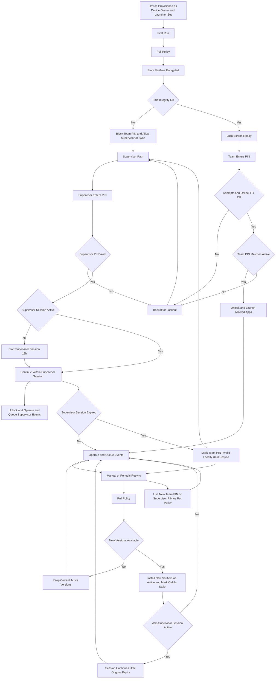
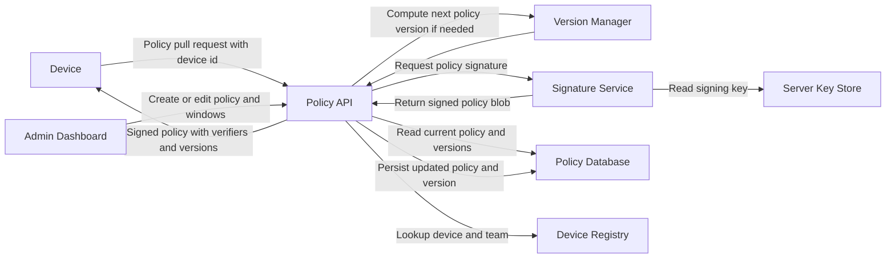
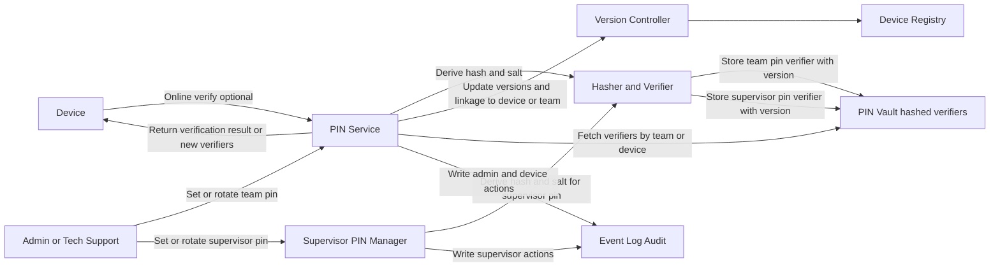
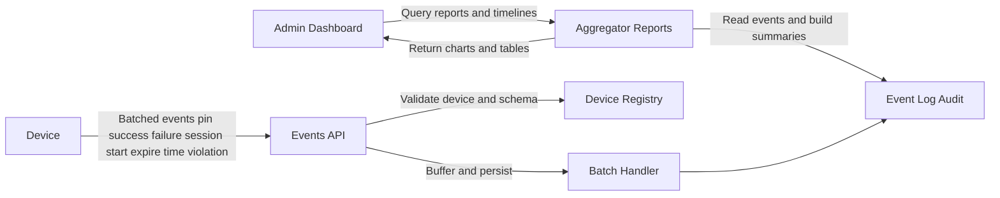

You're right — my earlier Mermaid used features some renderers choke on. Here are **strict, parser-friendly** versions (no special shapes, no classes, no slashes, minimal punctuation).

# Level-0 DFD (actors ↔ processes ↔ data stores)

# End-to-end workflow (onboarding → normal → failures → supervisor → resync → invalidation)

## Level 1 DFDs
 — here are **Level-1 DFDs** using strict, parser-friendly Mermaid. I’ve expanded the **Policy API**, the **PIN Service**, and the **Events Ingest** so you can see the internal data flows without fancy shapes or syntax.

# Level-1 DFD — Policy API

# Level-1 DFD — PIN Service

# Level-1 DFD — Events Ingest and Telemetry

These drop straight into your spec and align with the behaviors we discussed: signed policy delivery, versioned PIN verifiers, supervisor grant handling, and full audit trails.
