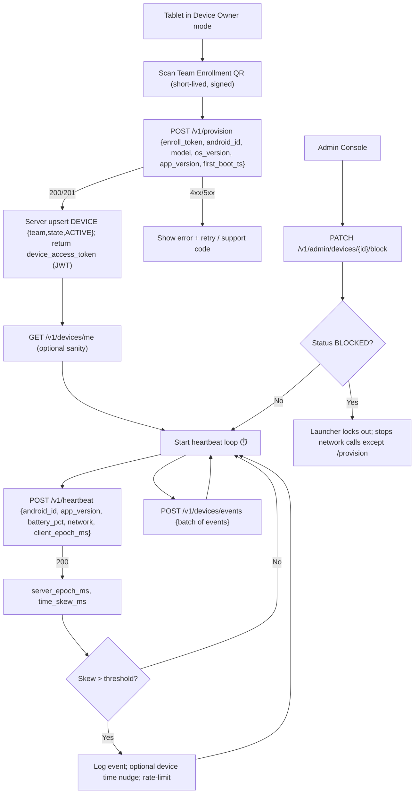

Sweet — here’s a tight **Device flowchart** plus **user (device-side) and admin APIs** you can drop into your spec. It assumes zero pre-enrollment, JIT provisioning, and your existing roles (national admin, state admin, team member, supervisor).

## Device provisioning & runtime — flowchart (Mermaid)



---

## Auth & RBAC (summary)

* **Device APIs**: Bearer `device_access_token` (JWT) minted at `/v1/provision` (scoped to that device id + team id).
* **Admin APIs**: Bearer user JWT.

  * `national_admin`: all states/teams/devices.
  * `state_admin`: devices of assigned `state_id`.
  * `team_member`: devices of assigned `team_id` (read; optionally limited writes).
  * `supervisor`: generally read-only (own team), no destructive ops.

---

## User (device) APIs

### 1) Provision (JIT upsert)

**POST** `/v1/provision`
Create or update a device at first boot.

Request

```json
{
  "enroll_token": "eyJhbGciOiJFZERTQSIsInR5cCI6IkpXVCJ9.eyJ0ZWFtX2lkIjoi...\",\"exp\":1759900000}",
  "android_id": "a1b2c3d4e5f6",
  "model": "Lenovo TB-8505X",
  "manufacturer": "LENOVO",
  "os_version": "Android 13",
  "app_version": "1.0.3",
  "first_boot_ts": 1759856000
}
```

Success (201 Created on first time, 200 OK on update)

```json
{
  "device_id": "7ad9e9e9-0c4d-4b14-90f7-2f9c0b7d8a11",
  "team_id": "ab12cdef-3456-7890-ab12-cdef34567890",
  "state_id": "cd34abcd-5678-90ab-cd34-abcd567890ab",
  "status": "ACTIVE",
  "device_access_token": "eyJhbGciOiJIUzI1NiIsInR5cCI6IkpXVCJ9..."
}
```

Errors

* `400` invalid payload
* `401/403` bad/expired enroll_token
* `409` android_id conflict with different team policy (rare; show support code)
* `423` team temporarily blocked

Idempotency: **Yes** by `android_id` (server uses upsert).

---

### 2) Device “who am I”

**GET** `/v1/devices/me` (auth: device token)

Response

```json
{
  "device_id": "7ad9e9e9-0c4d-4b14-90f7-2f9c0b7d8a11",
  "android_id": "a1b2c3d4e5f6",
  "team_id": "ab12cdef-3456-7890-ab12-cdef34567890",
  "state_id": "cd34abcd-5678-90ab-cd34-abcd567890ab",
  "status": "ACTIVE",
  "app_version_required": ">=1.0.3",
  "server_epoch_ms": 1759856000456
}
```

---

### 3) Heartbeat

**POST** `/v1/heartbeat` (auth: device token)

Request

```json
{
  "android_id": "a1b2c3d4e5f6",
  "app_version": "1.0.4",
  "battery_pct": 78,
  "network": "wifi",
  "client_epoch_ms": 1759856000123
}
```

Response

```json
{ "server_epoch_ms": 1759856000456, "time_skew_ms": 333 }
```

Notes

* Upserts `last_seen_at`, `last_seen_ip`, `app_version`.
* If server marks device `BLOCKED/RETIRED`, return `409` with `{ "status": "BLOCKED" }` and the launcher must lock.

---

### 4) Device telemetry events (optional but useful)

**POST** `/v1/devices/events` (auth: device token)

Request

```json
{
  "android_id": "a1b2c3d4e5f6",
  "events": [
    {"ts": 1759856000456, "type": "pin_success", "subtype": "TP", "version": 6},
    {"ts": 1759857000123, "type": "time_violation", "skew_ms": 42000}
  ]
}
```

Response

```json
{ "accepted": 2 }
```

Rate limit: 1 batch / 30–60s per device, size ≤ 100.

---

## Admin APIs (devices)

Base path: `/v1/admin/devices` (auth: user JWT). All responses are JSON. RBAC enforced as noted.

### 1) List/search devices

**GET** `/v1/admin/devices?state_id=&team_id=&status=&q=&page=&page_size=`

Response

```json
{
  "items": [
    {
      "id": "7ad9e9e9-0c4d-4b14-90f7-2f9c0b7d8a11",
      "android_id": "a1b2c3d4e5f6",
      "team_id": "ab12cdef-3456-7890-ab12-cdef34567890",
      "state_id": "cd34abcd-5678-90ab-cd34-abcd567890ab",
      "status": "ACTIVE",
      "model": "Lenovo TB-8505X",
      "os_version": "Android 13",
      "app_version": "1.0.4",
      "last_seen_at": "2025-10-07T09:05:00Z",
      "last_seen_ip": "203.0.113.10"
    }
  ],
  "page": 1, "page_size": 50, "total": 1234
}
```

* `national_admin`: all devices.
* `state_admin`: their `state_id` only.
* `team_member`: their `team_id` only.

---

### 2) Get one device

**GET** `/v1/admin/devices/{device_id}`

Response

```json
{
  "id": "7ad9e9e9-0c4d-4b14-90f7-2f9c0b7d8a11",
  "android_id": "a1b2c3d4e5f6",
  "team_id": "ab12cdef-3456-7890-ab12-cdef34567890",
  "state_id": "cd34abcd-5678-90ab-cd34-abcd567890ab",
  "status": "ACTIVE",
  "model": "Lenovo TB-8505X",
  "manufacturer": "LENOVO",
  "os_version": "Android 13",
  "app_version": "1.0.4",
  "first_boot_ts": 1759856000,
  "last_seen_at": "2025-10-07T09:05:00Z",
  "last_seen_ip": "203.0.113.10",
  "attestation": { "present": false }
}
```

---

### 3) Update metadata (non-destructive)

**PATCH** `/v1/admin/devices/{device_id}`

Request (any subset)

```json
{
  "tablet_name": "Team-Delhi-07",
  "notes": "Issued to Supervisor S123 on 2025-10-06"
}
```

Response: `200` with updated device.

---

### 4) Block / Unblock device

* **PATCH** `/v1/admin/devices/{device_id}/block`
  Body: `{ "reason": "Lost in transit" }` → sets `status=BLOCKED`.
* **PATCH** `/v1/admin/devices/{device_id}/unblock`
  Body: `{ "reason": "Recovered" }` → sets `status=ACTIVE`.

Device behavior: on next heartbeat, launcher must lock (BLOCKED) or resume (ACTIVE).

---

### 5) Retire device

**PATCH** `/v1/admin/devices/{device_id}/retire`
Body: `{ "reason": "Hardware failure" }` → sets `status=RETIRED`. Launcher should show retire screen and stop ops.

---

### 6) Transfer device to another team (and state)

**PATCH** `/v1/admin/devices/{device_id}/transfer`

Request

```json
{ "target_team_id": "9f8e7d6c-5432-10ab-9f8e-7d6c543210ab" }
```

Response: `200` with new `team_id`/`state_id`.
Rules: allowed to `national_admin`; allowed to `state_admin` **only if** both teams are in their states; typically **not** allowed to team_member.

Launcher action: refresh config on next heartbeat; optionally force a local data wipe (your call).

---

### 7) Export (CSV)

**GET** `/v1/admin/devices/export?state_id=&team_id=&status=`
Streams CSV with common columns for inventory.

---

### 8) Rotate team enrollment token (no pre-enroll; supports JIT)

**POST** `/v1/admin/teams/{team_id}/enrollment-token`
Response

```json
{
  "enroll_token": "eyJhbGciOiJFZERTQSIsInR5cCI6IkpXVCJ9... (exp in 20 min)",
  "qr_svg": "<svg .../>"
}
```

Permissions: `national_admin` or `state_admin` (team in scope) or `team_member` with manage-devices permission.

---

## Error model (shared)

```json
{ "error": "invalid_token", "message": "Enrollment token expired" }
{ "error": "forbidden", "message": "Team not in your scope" }
{ "error": "conflict", "message": "android_id already active in another team" }
{ "error": "blocked", "message": "Device is blocked" }
```

## Rate limits (suggested)

* `/v1/provision`: 5/min per IP, 20/hour per team.
* `/v1/heartbeat`: 1/min per device (burst 3).
* Admin list/search: 10/sec per user (burst 30).

## Notes

* You can add **policy endpoints later** without changing these.
* Device table stays minimal; everything is **created automatically at provisioning** and then reused for telemetry and control.

If you want this as a Postman collection (with example JWT variables) or a Flask blueprint skeleton, I can generate it.
